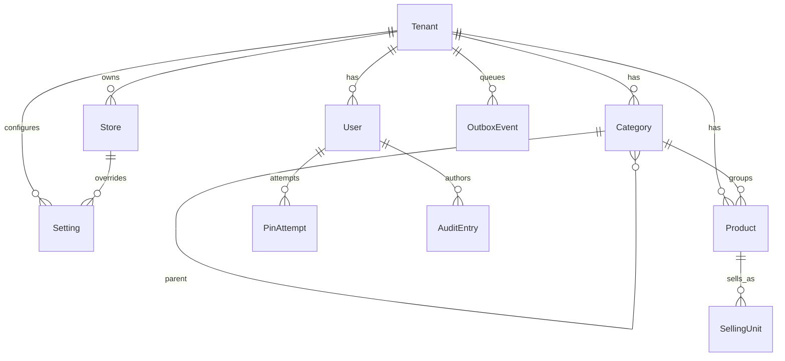

# Spécification fonctionnelle — U2 Socle (`u2-foundation`)

> Résumé consolidé confirmé (`Looks correct`).

**Unité.** Bibliothèque partagée : schéma et migrations, identité PIN/rôles, paramètres, écriture transactionnelle (audit + outbox), masquage sensible, seed démo, **forme** catalogue sans quantités.

**Frontière.** Aucune règle de calcul stock/CUMP/totaux (U3). Aucun écran de vente ni import catalogue (U4/U5). Les tables caisse/ventes ne sont pas créées ici (Q1-B).

**Composants.** Identity, Settings, TransactionalWriter, SensitiveDataGuard ; persistence Product/SellingUnit/Category pour accélérer U4.

---

## Diagramme entité-relation (dérivé de `entities.md`)

## Synthèse des règles (dérivée de `rules.md`)

| Groupe | IDs | Intent |
|---|---|---|
| Schéma / tenant | BR1.1–BR1.5 | Métadonnées, migrations, UUID v7, isolation, append-only |
| Identité | BR2.1–BR2.4 | PIN hors ligne, blocage, gerant |
| Paramètres | BR3.1–BR3.2 | Typés, défauts, surcharge |
| Transaction | BR4.1–BR4.3 | Donnée + audit + outbox atomiques |
| Catalogue / garde | BR5.1–BR5.4 | Forme article, masquage vendeur |
| Seed | BR6.1–BR6.2 | Démo sans ventes |

---

## WF1 — Authentification PIN hors ligne

1. L’opérateur choisit un utilisateur actif autorisé sur le magasin courant.
2. Identity vérifie le non-blocage (BR2.2) à partir des PinAttempt récentes.
3. Le PIN saisi est dérivé localement (BR2.1) et comparé à `pinHash`.
4. Une PinAttempt est append (succès ou échec) (BR2.3).
5. Si succès : session applicative Identity (pas encore session de caisse U5) ; `lastActivityAt` mis à jour.
6. Si échec et seuil atteint : blocage jusqu’à expiration de la fenêtre 10 minutes.

**États User (auth).** `active` ∈ {true, false} ; blocage PIN = état dérivé des PinAttempt, pas un champ mutable obligatoire.

## WF2 — Assignation / révocation du rôle gérant

1. Seul un `proprietaire` peut démarrer le flux (BR2.4).
2. Cible : User du même tenant, `active=true`.
3. Assignation : tout autre `gerant` actif du tenant passe à un rôle non-gérant ; la cible devient `gerant`.
4. TransactionalWriter commit : mises à jour User + AuditEntry (`ROLE_ASSIGNE` / `ROLE_REVOQUE`) + OutboxEvent (BR4.1).
5. Révocation symétrique sans laisser d’ambiguïté sur « qui est gérant ».

## WF3 — Lecture d’un paramètre

1. Settings reçoit une clé et le contexte (tenant, store optionnel).
2. Résolution : surcharge magasin → tenant → défaut documenté (BR3.2).
3. Validation de forme typée à la frontière (BR3.1) ; échec = erreur explicite, pas de valeur inventée.

## WF4 — Mutation métier générique (contrat TransactionalWriter)

Précondition : auteur Identity connu ; tenant courant ; charge déjà validée métier (calculs hors unité).

1. Ouvrir une transaction locale unique.
2. Écrire la ou les entités métier.
3. Append AuditEntry (avant/après si pertinent) (BR1.3, FR6.1).
4. Append OutboxEvent avec `localSequence` suivant (BR4.2, BR4.3).
5. Commit ; en cas d’erreur à n’importe quelle étape → rollback total (BR4.1).
6. Aucun transport SyncEngine n’est requis pour réussir (file qui s’accumule).

**Machine d’état OutboxEvent (cette unité).** `created` seulement ; marquage « envoyé » appartient à U8 SyncEngine.

## WF5 — Projection catalogue filtrée

1. Lecture Product (+ SellingUnit) pour un rôle donné.
2. SensitiveDataGuard applique BR5.1 si `vendeur`.
3. Aucune quantité n’est lue depuis Product (BR5.2).

## WF6 — Seed de démonstration

1. Créer Tenant fictif, Store, Settings par défaut documentés.
2. Créer 3 User (rôles distincts, PIN dérivés).
3. Créer ~200 Product avec SellingUnit de base et prix cohérents (BR5.3) ; `active=true`.
4. **Ne pas** créer de ventes ni mouvements de stock (BR6.1) — portion « 30 jours de ventes » de FR1.7 reportée à l’unité qui pose le schéma ventes.
5. Respect BR6.2 sur les artefacts de code.

## WF7 — Migration schéma

1. Appliquer migration N (BR1.2).
2. Vérifier que le chemin inverse N↓ restaure l’état.
3. Inclure dans N : identité, settings, audit, outbox, catalogue (Category/Product/SellingUnit) sans tables vente/stock.

---

## Hors scope explicite

| Sujet | Où |
|---|---|
| Calcul stock / CUMP / alertes pures | U3 |
| UI import / recherche / saisie photo | U4 |
| Session caisse, vente, clôture | U5 |
| Vidage outbox / transports | U8 |
| FR1.1 structure apps caisse/proprio/API | U14 |
