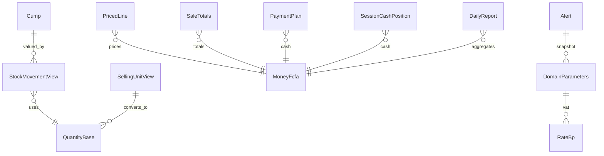

# Spécification fonctionnelle — U3 Domaine (`u3-domain`)

> Résumé consolidé confirmé (`Looks correct`).

**Unité.** Bibliothèque de fonctions **pures** : stock, CUMP, unités, tarification, totaux/marges, paiements, espèces de session, alertes, rapport.

**Frontière.** Aucune base, UI ni réseau. Les appels viennent de U5 (caisse), U6 (audit/alertes branchées), U7 (réception), etc. Couverture ≥ 90 % lignes et branches ; tests d’abord ; propriétés (FR2.10).

**Composants.** StockLedger, Costing, Pricing, SaleCalculator, CashSession, AlertEngine, Reporting.

**Hors scope explicite.** FR4.16 (ajout ticket au clavier) est une exigence d’**interface** — reportée à `u5-register` ; aucun workflow UI ici.

---

## Diagramme entité-relation (dérivé de `entities.md`)

## Synthèse des règles (dérivée de `rules.md`)

| Groupe | IDs | Intent |
|---|---|---|
| Représentation | BR1.1–BR1.2 | Entiers + arrondi unique |
| Stock | BR2.1–BR2.4 | Somme, historique, négatif OK, conversion |
| CUMP | BR3.1–BR3.3 | Entrées, ≥ 0, valorisation |
| Prix | BR4.1–BR4.2 | Remise, plancher |
| Ticket | BR5.1–BR5.3 | Totaux, marge, paiements |
| Session | BR6.1–BR6.2 | Théorique, écart |
| Alertes / rapport | BR7.x–BR8.1 | AL-xx, DailyReport |
| Pureté | BR9.1 | Frontière package |

---

## WF1 — Quantité et état de stock (StockLedger)

1. Entrée : liste immuable de `StockMovementView` pour `(productId, storeId)`.
2. `quantiteStock` applique BR2.1 (somme signée).
3. `etatStockAu(date)` filtre puis somme (BR2.2).
4. Conversion via `SellingUnitView` (BR2.4) si la quantité est saisie en unité de vente.
5. Aucun refus si résultat < 0 (BR2.3) ; AlertEngine pourra émettre AL-09 (WF6).

**États.** Pas de machine d’état persistée — la quantité est un **état dérivé**.

## WF2 — Recalcul CUMP (Costing)

1. Entrée : historique ordonné (ou rejouable) des mouvements + coût d’entrée.
2. Pour chaque entrée `q > 0` au coût `c` : appliquer BR3.1 (cas Q ≤ 0 inclus).
3. Sorties : valoriser au CUMP courant, CUMP inchangé.
4. Retour annulation : coût de la sortie d’origine ; ajustement inventaire positif : CUMP inchangé (RG-11).
5. Invariants de propriété (BR3.2) vérifiés par tests, pas par garde runtime.

## WF3 — Tarification d’une ligne (Pricing)

1. Entrée : prix référence, prix appliqué, plancher, quantité vente (millièmes), paramètres.
2. Calcul remise (BR4.1), indicateur sous plancher + écart pb (BR4.2), et `lineAmountTtc` = arrondir(prix_applique × quantite_vente_milliemes, 1000) (RG-04).
3. Sortie : `PricedLine` immuable (inclut `lineAmountTtc`). Motif sous plancher = responsabilité UI (U5), pas du domaine.

## WF4 — Totaux et paiements d'un ticket (SaleCalculator)

1. Entrée : lignes tarifiées, CUMP au moment, `DomainParameters` (TVA, arrondi espèces).
2. Chaque `PricedLine` arrive déjà avec `lineAmountTtc` (calculé en WF3 / BR4) ; agréger totaux, ventilation HT (BR5.1), coûts/marges (BR5.2).
3. Entrée `PaymentItem[]` → validation RG-06 (BR5.3) ; refus si insuffisant ou rendu > espèces ; `credit` exclu du rendu.
4. Arrondi espèces uniquement sur le montant espèces ; `cashRoundingDelta` sur le ticket (BR1.2).
5. Sortie : `PricedLine[]` reconstruits par spread avec `lineAmountHt` renseigné (immutabilité WF3 respectée) + `SaleTotals` + `PaymentPlan` (ou erreur de validation). Σ lineAmountHt = totalHt.

**États ticket (calcul).** `draft_totals` → `payable` → `balanced` ; pas de persistance ici.

## WF5 — Position de caisse session (CashSession)

1. Entrée : fond initial, ventes espèces nettes de la session, mouvements espèces, remboursements, comptage, fond laissé.
2. `especes_theoriques` (BR6.1) puis écart et versement (BR6.2).
3. Sortie : `SessionCashPosition`. L'ordre « comptage avant théorique » (EF-U3-31) est une contrainte **UI/U5** ; le domaine ne révèle le théorique que lorsqu'on le lui demande.

## WF6 — Évaluation d'alertes (AlertEngine)

1. `evaluerAlertes(DomainEvent, AlertContext, DomainParameters)` pour règles événementielles.
2. `evaluerAlertesPeriodiques(AlertHistory, DomainParameters)` pour fenêtres glissantes.
3. Chaque `Alert` porte snapshot des paramètres (BR7.1).
4. Catalogue (famille → code) :
   - **Événementielles** : AL-01 `session_closed` (|écart| > seuil) ; AL-02 `session_opened` (écart ≠ 0) ; AL-03 `session_force_closed` ; AL-04 `sale_cancelled` ; AL-05 `line_priced` (sous plancher > seuil pb) ; AL-08 `stock_adjusted` ; AL-09 `stock_changed` (Q < 0) ; AL-16/AL-18 `stock_changed` selon payload.
   - **Glissantes** : AL-06, AL-07, AL-10, AL-11 via `AlertHistory` (BR7.3 pour échantillon). AL-10 n'est **pas** émise sur chaque `cash_outflow` : l'événement alimente seulement l'historique.
   - **Hors cœur U3** (canal/sync/UI) : AL-12 à AL-15, AL-17, AL-19, AL-21, AL-22 — évaluables si le contexte est fourni, sinon branchées en U5/U6/U8.
5. AL-09 n'implique aucun blocage de vente (BR7.2).
6. Canaux de notification hors unité.

## WF7 — Rapport journalier (Reporting)

1. Entrée : agrégats du jour déjà collectés (ventes, sessions, alertes) — pas d’I/O.
2. `rapportJournalier` → `DailyReport` (BR8.1), y compris taux RG-30 si échantillon suffisant (BR7.3).
3. Masquage vendeur (prix d’achat, CUMP, marge) = SensitiveDataGuard (U2) à la **présentation**, pas dans le calcul du rapport propriétaire.

---

## Scénarios clés

| ID | Scénario | Attendu |
|---|---|---|
| S1 | Sortie avec Q théorique 0 | Q négative ; pas d’erreur domaine ; AL-09 possible |
| S2 | Première entrée après Q < 0 | CUMP = coût d’entrée (BR3.1) |
| S3 | TVA off | totalHt = totalTtc ; vat = 0 |
| S4 | Paiement mobile seul, rendu demandé | refus BR5.3 |
| S5 | Suite aléatoire mouvements + inverse | propriétés FR2.10 |

## Non-objectifs

- Persistance, outbox, sessions UI, import catalogue, sync.
- FR4.16 (clavier caisse) → `u5-register`.
