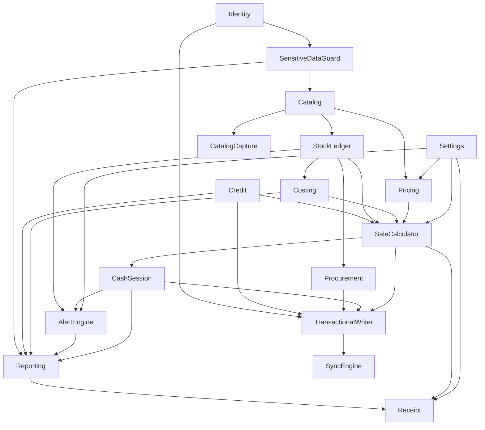

# Catalogue des composants — TenuXpector

Entrées : `aidlc/spaces/default/intents/260916-caisse-hors-ligne-3/inception/requirements-analysis/requirements.md`, `aidlc/spaces/default/intents/260916-caisse-hors-ligne-3/inception/practices-discovery/team-practices.md`, `docs/exigences-tenuxpector.md`.

Un composant est une brique de code à écrire, avec ses règles, ses entités et son cycle de vie. La base de données, l'imprimante ou le serveur de synchronisation sont des **dépendances externes**, jamais des composants. Le code est en anglais (glossaire au §12 du document d'exigences) ; les entités portent ici leurs noms de code.

## Catalogue

```yaml
components:
  - name: StockLedger
    summary: Journal immuable des mouvements de stock et calcul des quantités
    behaviour: >
      Fonctions pures. La quantité d'un article est la somme signée de ses mouvements ;
      l'état à une date ne tient compte que des mouvements antérieurs. Aucune écriture,
      aucune suppression : une correction est un mouvement inverse daté du jour. Le stock
      peut devenir négatif, ce qui déclenche une alerte plutôt qu'un refus. Quantités en
      millièmes d'unité de base, en entiers.
    responsibilities:
      - Calculer la quantité et l'état du stock à une date
      - Convertir entre unité de vente et unité de base
      - Produire les mouvements à partir d'une vente, d'une réception ou d'un ajustement
    depends_on:
      - component: Catalog
        interaction: identifie l'article d'un mouvement et son unité de base
        style: sync
    dependents:
      - component: Costing
        interaction: fournit la séquence de mouvements pour recalculer le coût moyen
      - component: SaleCalculator
        interaction: produit les mouvements de sortie d'une vente
      - component: Procurement
        interaction: produit les mouvements d'entrée d'une réception
      - component: AlertEngine
        interaction: fournit la quantité pour les alertes de rupture et de seuil
    entities:
      - name: StockMovement
        identifier: id
        attributes: [id, tenantId, storeId, productId, kind, baseQuantity, unitCost, documentKind, documentId, reason, userId, sessionId, operationDate, recordDate, deviceId]
        references:
          - entity: Product
            owned_by: Catalog
            relationship: chaque mouvement porte sur un article
      - name: StockLevel
        identifier: productId
        attributes: [tenantId, storeId, productId, quantity, value, updatedAt]

  - name: Costing
    summary: Coût unitaire moyen pondéré et valorisation du stock
    behaviour: >
      Fonctions pures. À chaque entrée de quantité positive, le coût moyen est recalculé ;
      si le stock antérieur est nul ou négatif, il prend le coût de l'entrée. Les sorties
      ne modifient jamais le coût moyen et sont valorisées au coût courant. Un retour de
      marchandise rentre au coût de la sortie d'origine. Coût moyen en millièmes de FCFA.
    responsibilities:
      - Recalculer le coût moyen pondéré
      - Valoriser le stock et calculer le coût d'une ligne
    depends_on:
      - component: StockLedger
        interaction: lit la séquence de mouvements
        style: sync
    dependents:
      - component: SaleCalculator
        interaction: fournit le coût courant pour la marge d'une ligne
      - component: Reporting
        interaction: fournit la valorisation du stock
    entities: []

  - name: Catalog
    summary: Articles, unités de vente, prix de référence et prix plancher
    behaviour: >
      Un article n'est jamais supprimé, seulement désactivé. Le code interne est unique par
      tenant ; le prix plancher est inférieur ou égal au prix de référence. La recherche est
      insensible à la casse et aux accents et couvre désignation, synonymes, code interne et
      code-barres. L'import initial crée les articles et leurs prix, jamais de quantité.
    responsibilities:
      - Détenir les articles, leurs unités de vente et leurs prix
      - Valider une fiche article et une ligne d'import
      - Fournir la recherche d'article
    depends_on:
      - component: SensitiveDataGuard
        interaction: filtre le prix d'achat d'une fiche article selon le rôle
        style: sync
    dependents:
      - component: Pricing
        interaction: fournit prix de référence et prix plancher d'une unité de vente
      - component: StockLedger
        interaction: identifie l'article d'un mouvement
      - component: CatalogCapture
        interaction: crée les articles validés après extraction
    entities:
      - name: Product
        identifier: id
        attributes: [id, tenantId, internalCode, barcode, name, altNames, categoryId, baseUnit, averagePurchaseCost, referencePrice, floorPrice, stockAlertThreshold, location, active]
      - name: SellingUnit
        identifier: id
        attributes: [id, productId, label, conversionFactor, price, floorPrice]
      - name: Category
        identifier: id
        attributes: [id, tenantId, name, parentId]

  - name: Pricing
    summary: Tarification d'une ligne, remise et détection du sous-plancher
    behaviour: >
      Fonctions pures, arithmétique entière. La remise de ligne est l'écart positif entre
      prix de référence et prix appliqué, multiplié par la quantité. Une ligne est sous
      plancher quand le prix appliqué est inférieur au plancher applicable ; l'écart au
      plancher est exprimé en points de base. Une vente sous plancher n'est jamais bloquée,
      elle exige un motif.
    responsibilities:
      - Calculer remise, indicateur sous plancher et écart au plancher
      - Appliquer l'arrondi commun et les multiples conseillés
    depends_on:
      - component: Catalog
        interaction: lit prix de référence et prix plancher
        style: sync
      - component: Settings
        interaction: lit l'arrondi des espèces et le multiple conseillé
        style: sync
    dependents:
      - component: SaleCalculator
        interaction: fournit le prix retenu et la remise d'une ligne
    entities: []

  - name: SaleCalculator
    summary: Totaux d'un ticket, paiements, rendu de monnaie et marge
    behaviour: >
      Fonctions pures. Le total toutes taxes comprises est la somme des lignes ; le hors
      taxes n'est calculé que si la TVA est applicable, la dernière ligne absorbant le reste
      de ventilation. La somme des paiements doit atteindre le total ; le rendu ne peut
      venir que des espèces et ne peut dépasser les espèces reçues. La marge d'une ligne
      peut être négative.
    responsibilities:
      - Calculer les totaux, la marge et le rendu de monnaie
      - Valider la cohérence des paiements d'une vente
      - Produire les mouvements de stock et de caisse d'une vente validée
    depends_on:
      - component: Pricing
        interaction: obtient prix retenu et remise par ligne
        style: sync
      - component: Costing
        interaction: obtient le coût courant pour la marge
        style: sync
      - component: StockLedger
        interaction: produit les mouvements de sortie
        style: sync
      - component: Credit
        interaction: vérifie le plafond quand un paiement est à crédit
        style: sync
      - component: Settings
        interaction: lit la TVA applicable et les modes de paiement autorisés
        style: sync
    dependents:
      - component: TransactionalWriter
        interaction: fournit le résultat calculé à écrire
      - component: Receipt
        interaction: fournit les données du ticket
      - component: CashSession
        interaction: fournit les espèces nettes des ventes de la session
    entities:
      - name: Sale
        identifier: id
        attributes: [id, number, tenantId, storeId, sessionId, userId, customerId, saleDate, totalExcludingTax, taxAmount, totalIncludingTax, totalDiscount, totalMargin, status, cancelledBy, cancelledAt, cancellationReason, cancellationSessionId]
        references:
          - entity: RegisterSession
            owned_by: CashSession
            relationship: chaque vente appartient à une session de caisse ouverte
          - entity: Customer
            owned_by: Credit
            relationship: une vente à crédit désigne le client débité
          - entity: User
            owned_by: Identity
            relationship: chaque vente porte l'opérateur qui l'a encaissée
      - name: SaleLine
        identifier: id
        attributes: [id, saleId, productId, sellingUnitId, quantity, baseQuantity, appliedPrice, referencePrice, applicableFloorPrice, lineDiscount, unitCostAtSale, lineMargin, belowFloorReason]
        references:
          - entity: Product
            owned_by: Catalog
            relationship: chaque ligne porte sur un article
          - entity: SellingUnit
            owned_by: Catalog
            relationship: chaque ligne est vendue dans une unité de vente
      - name: Payment
        identifier: id
        attributes: [id, saleId, method, amount, transactionReference, collectedBy]
        references:
          - entity: User
            owned_by: Identity
            relationship: chaque paiement porte l'encaisseur
      - name: Cart
        identifier: id
        attributes: [id, sessionId, lines, createdAt, updatedAt]
        references:
          - entity: RegisterSession
            owned_by: CashSession
            relationship: un panier en attente appartient à la session qui l'a ouvert

  - name: CashSession
    summary: Session de caisse, mouvements d'espèces et clôture à l'aveugle
    behaviour: >
      Une session est ouverte par une seule personne, bornée par deux comptages. Les espèces
      théoriques valent le fond initial, plus les espèces nettes des ventes, plus les entrées,
      moins les sorties et les remboursements. L'écart est la différence entre compté et
      théorique. Le comptage est saisi avant tout affichage du théorique, et ne peut plus
      être modifié après. La clôture ne consulte aucun réseau.
    responsibilities:
      - Détenir la session, son fond, son versement et son écart
      - Calculer les espèces théoriques et l'écart
      - Détenir les mouvements d'espèces et les ouvertures de tiroir
    depends_on:
      - component: SaleCalculator
        interaction: obtient les espèces nettes des ventes de la session
        style: sync
    dependents:
      - component: AlertEngine
        interaction: fournit écarts et mouvements d'espèces
      - component: Reporting
        interaction: fournit les données de clôture
      - component: TransactionalWriter
        interaction: fournit la session à laquelle rattacher toute écriture
    entities:
      - name: RegisterSession
        identifier: id
        attributes: [id, tenantId, storeId, registerId, userId, openedAt, openingFloat, openingVariance, closedAt, expectedCash, countedCash, variance, varianceComment, closingFloat, handoverAmount, closedBy, closingMode, status]
        references:
          - entity: User
            owned_by: Identity
            relationship: une session est tenue par un seul opérateur, et peut être fermée par un autre
      - name: CashMovement
        identifier: id
        attributes: [id, sessionId, direction, amount, reason, beneficiary, userId, date]
        references:
          - entity: RegisterSession
            owned_by: CashSession
            relationship: chaque mouvement d'espèces appartient à une session
          - entity: User
            owned_by: Identity
            relationship: chaque mouvement porte son auteur
      - name: DrawerOpening
        identifier: id
        attributes: [id, sessionId, userId, saleId, reason, date]
        references:
          - entity: RegisterSession
            owned_by: CashSession
            relationship: chaque ouverture de tiroir appartient à une session
          - entity: Sale
            owned_by: SaleCalculator
            relationship: une ouverture peut être liée à une vente, ou n'en avoir aucune

  - name: Credit
    summary: Clients, plafond de crédit et compte client
    behaviour: >
      Un client porte un nom, un téléphone et un plafond. Le solde est calculé par somme des
      mouvements du compte, jamais stocké de façon mutable. Une vente à crédit qui porte le
      solde au-delà du plafond est refusée, sauf dérogation par PIN du propriétaire, tracée.
      Les remboursements partiels sont acceptés.
    responsibilities:
      - Détenir les clients et leur plafond
      - Calculer le solde et décider d'un dépassement
      - Détenir les mouvements de compte client
    depends_on: []
    dependents:
      - component: SaleCalculator
        interaction: autorise ou refuse un paiement à crédit
      - component: Reporting
        interaction: fournit les soldes pour le relevé
      - component: TransactionalWriter
        interaction: reçoit le mouvement de compte client à écrire dans la transaction
    entities:
      - name: Customer
        identifier: id
        attributes: [id, tenantId, name, phone, creditLimit, active]
      - name: CustomerAccountEntry
        identifier: id
        attributes: [id, customerId, kind, amount, saleId, settlementMethod, userId, date]
        references:
          - entity: Customer
            owned_by: Credit
            relationship: chaque mouvement appartient à un client
          - entity: Sale
            owned_by: SaleCalculator
            relationship: un débit de vente à crédit pointe la vente qui l'a créé

  - name: Procurement
    summary: Fournisseurs et réceptions directes de marchandise
    behaviour: >
      Une réception est saisie sans commande préalable : fournisseur, date, puis une ligne
      par article avec quantité et coût unitaire réel. Elle produit des mouvements d'entrée
      qui alimentent le coût moyen. Une réception validée n'est jamais modifiée : une erreur
      se corrige par une réception inverse datée du jour, avec motif. Aucun suivi de dette
      fournisseur.
    responsibilities:
      - Détenir les fournisseurs et les réceptions
      - Produire les mouvements d'entrée de stock au coût réel
    depends_on:
      - component: StockLedger
        interaction: produit les mouvements d'entrée
        style: sync
    dependents:
      - component: TransactionalWriter
        interaction: fournit la réception à écrire
    entities:
      - name: Supplier
        identifier: id
        attributes: [id, tenantId, name, phone, active]
      - name: GoodsReceipt
        identifier: id
        attributes: [id, tenantId, storeId, supplierId, receiptDate, userId, sessionId, reversalOfId, reason]
        references:
          - entity: Supplier
            owned_by: Procurement
            relationship: chaque réception vient d'un fournisseur
          - entity: User
            owned_by: Identity
            relationship: chaque réception porte son auteur
      - name: GoodsReceiptLine
        identifier: id
        attributes: [id, goodsReceiptId, productId, quantity, unitCost]
        references:
          - entity: GoodsReceipt
            owned_by: Procurement
            relationship: chaque ligne appartient à une réception
          - entity: Product
            owned_by: Catalog
            relationship: chaque ligne porte sur un article

  - name: AlertEngine
    summary: Règles d'alerte anti-vol, par événement et sur fenêtre glissante
    behaviour: >
      Fonctions pures évaluées sur la caisse, jamais sur le serveur. Deux familles : les
      règles déclenchées par un événement et les règles glissantes évaluées à chaque clôture
      et au démarrage. Chaque alerte porte l'opérateur, la session, l'entité liée, les
      valeurs déclenchantes et la valeur du paramètre au moment du déclenchement. Une alerte
      n'est jamais supprimée.
    responsibilities:
      - Évaluer les règles d'alerte et produire les alertes
      - Détenir les alertes et leur traitement
    depends_on:
      - component: CashSession
        interaction: lit écarts, mouvements d'espèces et sessions
        style: sync
      - component: StockLedger
        interaction: lit quantités et mouvements
        style: sync
      - component: Settings
        interaction: lit les seuils et les horaires
        style: sync
    dependents:
      - component: Reporting
        interaction: fournit les alertes du rapport
    entities:
      - name: Alert
        identifier: id
        attributes: [id, tenantId, storeId, kind, severity, title, details, relatedEntity, readAt, handledBy, handlingComment]

  - name: Reporting
    summary: Rapport de clôture, relevés et comparaison des opérateurs
    behaviour: >
      Fonctions pures. Le rapport journalier est produit à la dernière clôture de la journée
      ou à l'heure limite. Les taux par opérateur sont ramenés à 100 tickets et ne sont pas
      calculés sous l'échantillon minimal. Les données sensibles ne sortent qu'à travers le
      composant de masquage.
    responsibilities:
      - Produire le rapport journalier, le relevé client et la comparaison des opérateurs
    depends_on:
      - component: CashSession
        interaction: lit les clôtures
        style: sync
      - component: AlertEngine
        interaction: lit les alertes de la période
        style: sync
      - component: Costing
        interaction: lit la valorisation du stock
        style: sync
      - component: Credit
        interaction: lit les soldes clients
        style: sync
      - component: SensitiveDataGuard
        interaction: filtre les données sensibles du rapport selon le rôle
        style: sync
    dependents:
      - component: Receipt
        interaction: fournit le contenu du rapport imprimé
    entities: []

  - name: Settings
    summary: Paramètres métier typés, avec valeur par défaut et surcharge par magasin
    behaviour: >
      Toute valeur métier — TVA, devise, arrondis, seuils, horaires, mentions, modes de
      paiement — est lue ici, jamais écrite en dur. Lecture validée à la frontière ; une
      valeur absente prend sa valeur par défaut documentée.
    responsibilities:
      - Détenir et valider les paramètres
    depends_on: []
    dependents:
      - component: Pricing
        interaction: lit arrondis et multiples conseillés
      - component: AlertEngine
        interaction: lit les seuils et les horaires
      - component: SaleCalculator
        interaction: lit TVA et modes de paiement
      - component: Receipt
        interaction: lit les mentions de l'entreprise
    entities:
      - name: Setting
        identifier: id
        attributes: [id, tenantId, storeId, key, value]

  - name: Identity
    summary: Utilisateurs, PIN, rôles et dérogations
    behaviour: >
      PIN de 4 à 6 chiffres, haché, vérifié sans réseau ; blocage après cinq échecs en dix
      minutes. Le rôle de gérant est tournant, assignable et révocable par le propriétaire.
      Une dérogation enregistre l'opérateur de la session et l'auteur du PIN.
    responsibilities:
      - Détenir les utilisateurs, leurs rôles et les tentatives de PIN
      - Vérifier un PIN et autoriser une dérogation
    depends_on: []
    dependents:
      - component: SensitiveDataGuard
        interaction: fournit le rôle de l'utilisateur courant
      - component: TransactionalWriter
        interaction: fournit l'auteur de chaque écriture
    entities:
      - name: User
        identifier: id
        attributes: [id, tenantId, name, phone, pinHash, role, allowedStores, active, lastActivity]
      - name: PinAttempt
        identifier: id
        attributes: [id, userId, registerId, date, success]
        references:
          - entity: User
            owned_by: Identity
            relationship: chaque tentative porte sur un utilisateur

  - name: SensitiveDataGuard
    summary: Filtrage par rôle du prix d'achat, du coût moyen, de la marge et de la valorisation
    behaviour: >
      Toute lecture de donnée sensible passe par ce composant, côté caisse comme côté API.
      Il reçoit le rôle de l'utilisateur et la donnée, et retire les champs interdits à un
      vendeur : prix d'achat, coût moyen, marge, chiffre d'affaires cumulé, valorisation du
      stock, écarts des autres sessions. Une seule implémentation, testée une fois.
    responsibilities:
      - Décider quels champs un rôle peut voir
      - Retirer les champs interdits de toute donnée sortante
    depends_on:
      - component: Identity
        interaction: obtient le rôle de l'utilisateur courant
        style: sync
    dependents:
      - component: Reporting
        interaction: filtre les données du rapport selon le rôle
      - component: Catalog
        interaction: filtre les prix d'achat d'une fiche article
    entities: []

  - name: TransactionalWriter
    summary: Écriture atomique de la donnée métier et de son événement de synchronisation
    behaviour: >
      Propriétaire unique de la transaction locale. Il reçoit un résultat déjà calculé par le
      domaine et écrit, dans une seule transaction, la donnée métier, les mouvements associés,
      l'entrée d'audit et les événements de synchronisation. Toute écriture partielle est
      refusée : soit tout existe, soit rien. Aucune opération de caisse n'est écrite sans
      session ouverte ; toute requête métier filtre par tenant.
    responsibilities:
      - Posséder la transaction et garantir l'atomicité
      - Écrire l'audit et les événements de synchronisation
    depends_on:
      - component: SaleCalculator
        interaction: reçoit le résultat d'une vente à écrire
        style: sync
      - component: CashSession
        interaction: vérifie la session ouverte et écrit les mouvements d'espèces
        style: sync
      - component: Procurement
        interaction: reçoit une réception à écrire
        style: sync
      - component: Identity
        interaction: obtient l'auteur de l'écriture
        style: sync
      - component: Credit
        interaction: écrit le mouvement de compte client d'une vente à crédit ou d'un remboursement
        style: sync
    dependents:
      - component: SyncEngine
        interaction: alimente la file d'événements sortants
    entities:
      - name: AuditEntry
        identifier: id
        attributes: [id, tenantId, userId, sessionId, action, entityKind, entityId, before, after, deviceId, timestamp, serverTimestamp]
      - name: OutboxEvent
        identifier: id
        attributes: [id, tenantId, eventKind, entityId, payload, createdAt, localSequence]
    external_dependencies:
      - name: SQLite chiffré
        kind: database
        purpose: base locale de la caisse, chiffrée au repos

  - name: SyncEngine
    summary: Vidage de la file d'événements par un transport interchangeable
    behaviour: >
      Lit la file d'événements et la vide par lots ordonnés, avec un curseur par transport et
      un nouvel essai à délai croissant. Aucune fonctionnalité métier ne dépend de lui : sans
      transport configuré, la file s'accumule sans que rien ne casse.
    responsibilities:
      - Détenir les curseurs et la logique d'envoi
      - Définir l'interface de transport et ses implémentations
    depends_on:
      - component: TransactionalWriter
        interaction: lit la file d'événements sortants
        style: sync
    dependents: []
    entities:
      - name: SyncCursor
        identifier: transport
        attributes: [transport, lastSentSequence, lastReceivedCursor, lastSuccess]
      - name: TrustedDevice
        identifier: id
        attributes: [id, tenantId, userId, deviceFingerprint, registeredAt, revokedAt]
        references:
          - entity: User
            owned_by: Identity
            relationship: un appareil de confiance appartient au propriétaire
    external_dependencies:
      - name: Serveur de synchronisation
        kind: third-party-api
        purpose: réception des événements au niveau connecté
      - name: PostgreSQL
        kind: database
        purpose: base du serveur, avec isolation par tenant

  - name: Receipt
    summary: Composition des tickets, du rapport imprimé et des factures
    behaviour: >
      Compose le contenu à imprimer et le remet à un adaptateur remplaçable. Une impression
      échouée n'a jamais bloqué une vente : elle est mise en file et relançable. Une
      réimpression est marquée duplicata. La facture porte une numérotation propre, continue
      et sans trou, et sort au choix sur ticket thermique ou en PDF A4.
    responsibilities:
      - Composer tickets, ticket de clôture, rapport et facture
      - Détenir la numérotation des factures et la file d'impression
    depends_on:
      - component: SaleCalculator
        interaction: lit la vente à imprimer
        style: sync
      - component: Reporting
        interaction: lit le rapport à imprimer
        style: sync
      - component: Settings
        interaction: lit les mentions de l'entreprise
        style: sync
    dependents: []
    entities:
      - name: Invoice
        identifier: id
        attributes: [id, tenantId, number, saleId, customerId, issuedAt, medium, issuedBy]
        references:
          - entity: Sale
            owned_by: SaleCalculator
            relationship: chaque facture porte sur une vente
          - entity: Customer
            owned_by: Credit
            relationship: une facture à une entreprise désigne le client facturé
      - name: PrintJob
        identifier: id
        attributes: [id, kind, payload, status, attempts, lastError]
    external_dependencies:
      - name: Imprimante thermique 80 mm
        kind: other
        purpose: impression ESC/POS par adaptateur USB remplaçable

  - name: CatalogCapture
    summary: Saisie du catalogue par photo du registre, avec vérification avant import
    behaviour: >
      Reçoit une ou plusieurs photos du registre papier, en extrait désignations et prix de
      vente, et présente une liste modifiable. Rien n'est importé sans validation humaine.
      L'import crée les articles et leurs prix, jamais de quantité. Si un service tiers est
      retenu, aucun prix d'achat ne lui est transmis.
    responsibilities:
      - Piloter l'extraction et la vérification avant import
      - Produire les articles à créer dans le catalogue
    depends_on:
      - component: Catalog
        interaction: crée les articles validés
        style: sync
    dependents: []
    entities:
      - name: CaptureBatch
        identifier: id
        attributes: [id, tenantId, sourceImages, extractedLines, status, reviewedBy, reviewedAt]
    external_dependencies:
      - name: Reconnaissance de texte
        kind: third-party-api
        purpose: extraction du texte des photos ; sur l'appareil ou service tiers, à trancher à la preuve de concept
```

## Diagramme des composants



Lecture du diagramme : une flèche va du composant fournisseur vers celui qui l'appelle.

## Résumé des composants

Ce tableau est dérivé du bloc machine ci-dessus ; la symétrie des liens, l'absence de cycle et la résolution des références y sont vérifiées par un contrôle automatique, pas à la relecture.

| Composant | Rôle | Dépend de | Appelé par | Entités possédées |
|---|---|---|---|---|
| StockLedger | Journal de stock et quantités | Catalog | Costing, SaleCalculator, Procurement, AlertEngine | StockMovement, StockLevel |
| Costing | Coût moyen pondéré | StockLedger | SaleCalculator, Reporting | — |
| Catalog | Articles, unités, prix | SensitiveDataGuard | Pricing, StockLedger, CatalogCapture | Product, SellingUnit, Category |
| Pricing | Remise et sous-plancher | Catalog, Settings | SaleCalculator | — |
| SaleCalculator | Totaux, paiements, marge | Pricing, Costing, StockLedger, Credit, Settings | TransactionalWriter, Receipt, CashSession | Sale, SaleLine, Payment, Cart |
| CashSession | Session, espèces, clôture | SaleCalculator | AlertEngine, Reporting, TransactionalWriter | RegisterSession, CashMovement, DrawerOpening |
| Credit | Clients, plafond, solde | — | SaleCalculator, Reporting, TransactionalWriter | Customer, CustomerAccountEntry |
| Procurement | Fournisseurs et réceptions | StockLedger | TransactionalWriter | Supplier, GoodsReceipt, GoodsReceiptLine |
| AlertEngine | Règles d'alerte | CashSession, StockLedger, Settings | Reporting | Alert |
| Reporting | Rapport, relevés, comparaison | CashSession, AlertEngine, Costing, Credit, SensitiveDataGuard | Receipt | — |
| Settings | Paramètres métier | — | Pricing, AlertEngine, SaleCalculator, Receipt | Setting |
| Identity | Utilisateurs, PIN, rôles | — | SensitiveDataGuard, TransactionalWriter | User, PinAttempt |
| SensitiveDataGuard | Masquage par rôle | Identity | Reporting, Catalog | — |
| TransactionalWriter | Écriture atomique | SaleCalculator, CashSession, Procurement, Identity, Credit | SyncEngine | AuditEntry, OutboxEvent |
| SyncEngine | File d'événements et transports | TransactionalWriter | — | SyncCursor, TrustedDevice |
| Receipt | Tickets, rapport, factures | SaleCalculator, Reporting, Settings | — | Invoice, PrintJob |
| CatalogCapture | Saisie par photo | Catalog | — | CaptureBatch |

## Propriété des entités

Chaque entité porte l'identifiant de tenant, soit directement, soit par héritage de son entité parente : `SaleLine` et `Payment` par `Sale`, `CashMovement` et `DrawerOpening` par `RegisterSession`, `CustomerAccountEntry` par `Customer`, `GoodsReceiptLine` par `GoodsReceipt`, `PinAttempt` par `User`, `SellingUnit` par `Product`. Le filtrage par tenant s'applique donc à toute requête, y compris sur ces entités filles.

| Entité | Composant propriétaire | Identifiant | Références déclarées |
|---|---|---|---|
| StockMovement | StockLedger | id | Product (Catalog) |
| StockLevel | StockLedger | productId | — |
| Product | Catalog | id | — |
| SellingUnit | Catalog | id | — |
| Category | Catalog | id | — |
| Sale | SaleCalculator | id | RegisterSession (CashSession), Customer (Credit), User (Identity) |
| SaleLine | SaleCalculator | id | Product, SellingUnit (Catalog) |
| Payment | SaleCalculator | id | User (Identity) |
| Cart | SaleCalculator | id | RegisterSession (CashSession) |
| RegisterSession | CashSession | id | User (Identity) |
| CashMovement | CashSession | id | RegisterSession (CashSession), User (Identity) |
| DrawerOpening | CashSession | id | RegisterSession (CashSession), Sale (SaleCalculator) |
| Customer | Credit | id | — |
| CustomerAccountEntry | Credit | id | Customer (Credit), Sale (SaleCalculator) |
| Supplier | Procurement | id | — |
| GoodsReceipt | Procurement | id | Supplier (Procurement), User (Identity) |
| GoodsReceiptLine | Procurement | id | GoodsReceipt (Procurement), Product (Catalog) |
| Alert | AlertEngine | id | — |
| Setting | Settings | id | — |
| User | Identity | id | — |
| PinAttempt | Identity | id | User (Identity) |
| AuditEntry, OutboxEvent | TransactionalWriter | id | — |
| SyncCursor | SyncEngine | transport | — |
| TrustedDevice | SyncEngine | id | User (Identity) |
| Invoice | Receipt | id | Sale (SaleCalculator), Customer (Credit) |
| PrintJob | Receipt | id | — |
| CaptureBatch | CatalogCapture | id | — |

## Dépendances externes

| Composant | Dépendance | Nature | Usage |
|---|---|---|---|
| TransactionalWriter | SQLite chiffré | base de données | Base locale de la caisse, chiffrée au repos |
| SyncEngine | Serveur de synchronisation | service distant | Réception des événements au niveau connecté |
| SyncEngine | PostgreSQL | base de données | Base du serveur, isolation par tenant |
| Receipt | Imprimante thermique 80 mm | matériel | Impression ESC/POS par adaptateur USB remplaçable |
| CatalogCapture | Reconnaissance de texte | service ou bibliothèque | Extraction du texte des photos du registre |

## Justification du découpage

| Composant | Pourquoi une brique distincte |
|---|---|
| StockLedger | Possède le journal immuable ; change quand les types de mouvement changent, pas quand les prix changent |
| Costing | Une seule règle de calcul, appelée de partout ; isolée pour être testée exhaustivement |
| Catalog | Données de référence, rythme de changement propre, sans logique de vente |
| Pricing | Règles de négociation et de plancher ; changent avec la politique commerciale, pas avec le stock |
| SaleCalculator | Cœur de la vente ; concentre les règles d'argent, testées d'abord |
| CashSession | Possède le cycle de vie de la session, pivot de l'imputabilité |
| Credit | Cycle de vie et règles propres, ajoutés tard ; isolé pour ne pas alourdir la vente |
| Procurement | Entrée de marchandise, rythme de changement distinct de la vente |
| AlertEngine | Dispositif anti-vol ; doit évoluer sans toucher aux calculs d'argent |
| Reporting | Vue de lecture seule, changera souvent avec les besoins du propriétaire |
| Settings | Aucune valeur métier en dur ; une seule porte de lecture |
| Identity | Sécurité d'accès, changement rare, testé à part |
| SensitiveDataGuard | Invariant de confidentialité appliqué à deux endroits ; une seule implémentation évite deux failles |
| TransactionalWriter | Unique propriétaire de l'atomicité, l'invariant le plus coûteux à défaire |
| SyncEngine | Optionnel par conception ; doit pouvoir être absent sans casser la caisse |
| Receipt | Sortie matérielle, remplaçable, ne doit jamais bloquer une vente |
| CatalogCapture | Dépend d'un service non encore choisi ; isolé pour que ce choix reste réversible |

**Alternatives rejetées** : un domaine en un seul bloc (plus simple au départ, mais aucune frontière testable et un risque de mélanger les règles d'argent avec l'affichage) ; un découpage par unité de travail U1 à U8 (fait dépendre la structure du code d'un calendrier de livraison, pas du métier) ; un masquage réparti dans chaque composant (multiplie les implémentations d'un invariant de sécurité). Détail dans `decisions.md`.
