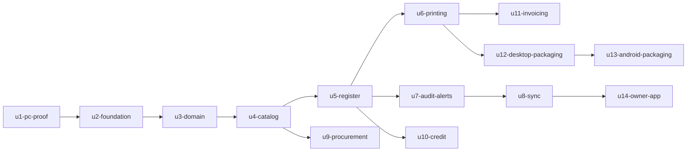

# Dépendances entre unités — TenuXpector V1

Entrée : `unit-of-work.md`. Cette page décrit **ce qui peut dépendre de quoi**. Elle ne choisit ni ordre de construction ni chemin critique : c'est le sujet de l'étape suivante.

## Graphe machine

```yaml
units:
  - name: u1-pc-proof
    kind: packaging
    depends_on: []
  - name: u2-foundation
    kind: library
    depends_on: [u1-pc-proof]
  - name: u3-domain
    kind: library
    depends_on: [u2-foundation]
  - name: u4-catalog
    kind: ui
    depends_on: [u3-domain]
  - name: u5-register
    kind: ui
    depends_on: [u4-catalog]
  - name: u6-printing
    kind: library
    depends_on: [u5-register]
  - name: u7-audit-alerts
    kind: library
    depends_on: [u5-register]
  - name: u8-sync
    kind: service
    depends_on: [u7-audit-alerts]
  - name: u9-procurement
    kind: ui
    depends_on: [u4-catalog]
  - name: u10-credit
    kind: ui
    depends_on: [u5-register]
  - name: u11-invoicing
    kind: ui
    depends_on: [u6-printing]
  - name: u12-desktop-packaging
    kind: packaging
    depends_on: [u6-printing]
  - name: u13-android-packaging
    kind: packaging
    depends_on: [u12-desktop-packaging]
  - name: u14-owner-app
    kind: ui
    depends_on: [u8-sync]
```

## Diagramme



Lecture : une flèche va de l'unité dont on dépend vers celle qui en dépend. Le graphe est acyclique, vérifié par contrôle automatique.

## Pourquoi chaque dépendance existe

| Dépendance | Raison |
|---|---|
| u2 ← u1 | Le socle reprend le code de la preuve de concept : base chiffrée, durcissement, impression |
| u3 ← u2 | Le domaine a besoin du schéma, des paramètres typés et de l'écriture transactionnelle |
| u4 ← u3 | Le catalogue s'appuie sur la tarification et les unités de vente du domaine |
| u5 ← u4 | On ne peut pas vendre un article qui n'existe pas |
| u6 ← u5 | Le ticket imprime une vente réelle |
| u7 ← u5 | Les alertes se branchent sur des sessions et des ventes réelles |
| u8 ← u7 | La synchronisation transporte aussi les alertes et le rapport |
| u9 ← u4 | Une réception porte sur des articles du catalogue |
| u10 ← u5 | Le crédit est un mode de paiement de la caisse |
| u11 ← u6 | La facture réutilise la composition et la file d'impression, ainsi que l'interface de sortie posée par U6 |
| u12 ← u6 | L'installateur embarque l'application complète, impression comprise |
| u13 ← u12 | La tablette reprend de U12 la configuration de compilation de l'interface partagée, le contrat des adaptateurs natifs et le scénario d'installation. Ce qui est propre à la cible — compilation du module natif de base chiffrée, impression, alimentation — est refait pour Android |
| u14 ← u8 | L'application du propriétaire lit ce que la synchronisation lui remonte |

## Dépendances écartées

| Dépendance envisagée | Pourquoi elle n'existe pas |
|---|---|
| u11 ← u10 | La facture doit désigner un **acheteur entreprise** par sa raison sociale et son NIU (FR10.3). Le client à crédit de U10 est une personne réduite à un nom et un téléphone : il ne porte pas de NIU et ne répond pas à ce besoin. U11 détient donc sa propre désignation d'acheteur. Quand une facture concerne une vente réglée à crédit, elle s'y rattache par un identifiant déjà écrit par la vente, sans avoir besoin du code de U10. Les deux unités restent indépendantes. |

## Points d'intégration

| Entre | Nature | Contenu |
|---|---|---|
| u3 → u5, u9, u10 | Appel en mémoire | Fonctions pures du domaine ; aucune entrée-sortie |
| u2 → toutes | Appel en mémoire | Écriture transactionnelle, paramètres, identité, masquage |
| u6 → matériel | Adaptateur | Flux ESC/POS vers l'imprimante USB |
| u8 → serveur | Réseau | Lots d'événements signés, idempotents, par transport |
| u8 → u14 | Réseau | Lecture du tableau de bord, contrôle d'accès vérifié dans l'API |
| u12, u13 → cibles | Empaquetage | Même code partagé, adaptateurs distincts |
| u4 → service de reconnaissance | Interface à implémenter | Extraction de texte, choix non tranché |

## Chemins parallèles possibles

Le graphe autorise plusieurs ordres. Une fois une unité terminée, ces ensembles n'ont aucune dépendance entre eux :

| Après | Peuvent avancer en parallèle |
|---|---|
| u4 — catalogue | u5 caisse et u9 approvisionnement |
| u5 — caisse | u6 impression, u7 audit et alertes, u10 crédit |
| u6 — impression | u12 empaquetage PC et u11 facturation |
| u7 — audit et alertes | u8 synchronisation |

Six unités n'ont qu'un seul prérequis chacune : u9, u10, u11, u12, u14 et u8. C'est une propriété du graphe, pas une recommandation : l'étape suivante seule décide de l'ordre.
