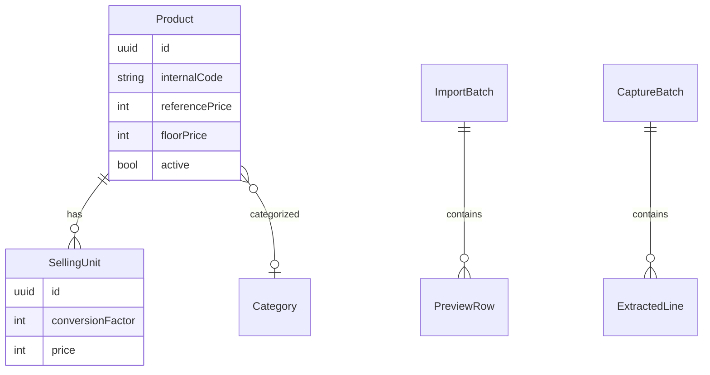

# Spécification fonctionnelle — U4 Catalogue (`u4-catalog`)

> Résumé consolidé confirmé (`Looks correct`). Spec **complète U4** (C1–C4) ; le code commence par **C1**.

**Unité.** Onglet Catalogue embarqué dans la caisse (`ui`). Kind `ui` : pas d’`entities.md` / `rules.md` séparés — règles **BR3.x** ci-dessous ; implémentation dans le domaine pur + UI sans règle métier.

**Composants.** Catalog, CatalogImport, CatalogCapture, CatalogUi ; usage de SensitiveDataGuard ; extension de TransactionalWriter (persist + outbox).

**Frontière.** Articles et prix seulement à l’import/photo — **jamais** de quantité ni mouvement de stock. Hors ligne pour le métier. Aucune règle dans CatalogUi. CR-02 : pas d’image ni prix d’achat chez un tiers avant spécimen.

**Bolts.** C1 fiche/recherche/rôles → C2 clavier/désactivation/étiquette → C3 import → C4 photo (OCR figé).

---

## Diagramme entité-relation (vue dérivée du domaine Catalogue)



## Synthèse des règles (BR3.x — source de vérité pour cette unité UI)

| Groupe | IDs | Intent |
|---|---|---|
| Fiche | BR3.1–BR3.3 | Contraintes fiche + unité de base |
| Recherche | BR3.4 | Fragment, casse/accents |
| Import | BR3.5–BR3.6 | Preview, pas de stock |
| Photo / OCR | BR3.7–BR3.8 | Vérification humaine, CR-02 |
| Saisie rapide | BR3.9–BR3.13 | Min 4 champs, série, duplication, synonymes, suggestion |
| Cycle de vie | BR3.14–BR3.16 | Désactivation, code/étiquette, correction/audit |
| Autorisation | BR3.17 | Masquage vendeur CT-09 |

```yaml
rules:
  - id: BR3.1
    statement: code_interne unique par tenant ; généré automatiquement s'il n'est pas fourni
    category: constraint
    applies_to: [Product]
    trigger: create / update
    logic: IF create sans code_interne THEN générer un code court unique pour le tenant ; IF collision THEN refus
    violation: VALIDATION_FAILED
    source: FR3.1, EF-U2-01, EF-U2-04

  - id: BR3.2
    statement: prix_plancher ≤ prix_vente_reference (entiers FCFA)
    category: validation
    applies_to: [Product, SellingUnit]
    trigger: saisie ou import de prix / plancher
    logic: IF floorPrice > referencePrice THEN refus avec message sur le champ plancher
    violation: VALIDATION_FAILED
    source: FR3.1, EF-U2-01

  - id: BR3.3
    statement: Au moins une unité de vente ; l'unité de base (facteur 1) est créée automatiquement à la création
    category: constraint
    applies_to: [Product, SellingUnit]
    trigger: create
    logic: IF create Product THEN créer SellingUnit base facteur 1 avec prix = prix de référence
    violation: VALIDATION_FAILED
    source: FR3.1, EF-U2-01

  - id: BR3.4
    statement: Recherche par fragment de désignation, synonymes, code interne ou code-barres ; insensible à la casse et aux accents
    category: policy
    applies_to: [Product]
    trigger: catalog.search
    logic: IF query normalisée (casse/accents) matche un des champs THEN inclure l'article actif (et inactifs seulement hors flux caisse)
    violation: N/A (liste vide)
    source: FR3.2, EF-U2-02

  - id: BR3.5
    statement: Import fichier en deux temps (prévisualisation puis validation) ; une ligne en erreur n'empêche pas les autres ; réimport par code_interne sans doublon d'article
    category: policy
    applies_to: [ImportBatch]
    trigger: importPreview / importCommit
    logic: IF ligne invalide THEN status error + rapport ; ELSE ok|warn|duplicate ; IF commit THEN upsert par code_interne, jamais créer un second article
    violation: lignes error hors commit ; VALIDATION_FAILED si lot vide
    source: FR3.3, EF-U2-03

  - id: BR3.6
    statement: Import et photo créent articles et prix seulement — aucun mouvement de stock, aucune quantité écrite
    category: constraint
    applies_to: [ImportBatch, CaptureBatch, Product]
    trigger: importCommit / captureCommit
    logic: IF commit catalogue THEN persister Product/SellingUnit + audit + outbox ; NEVER écrire quantité ni mouvement stock
    violation: refus conception / test d'invariant
    source: FR3.4, CT-05

  - id: BR3.7
    statement: Photo → extraction désignations et prix de vente seulement → écran de vérification obligatoire avant import
    category: policy
    applies_to: [CaptureBatch]
    trigger: capturePreview / captureCommit
    logic: IF extraction THEN lignes éditables ; IF commit sans acceptation humaine explicite THEN refus
    violation: VALIDATION_FAILED
    source: FR3.5

  - id: BR3.8
    statement: Moyen OCR figé en fin U4 ; défaut sur l'appareil tant que CR-02 ; jamais de prix d'achat ni image complète de coûts chez un tiers
    category: authorization
    applies_to: [CaptureBatch, TextRecognition]
    trigger: extractSaleLines
    logic: IF adaptateur réseau AND spécimen absent THEN indisponible ; IF appel tiers THEN payload sans prix d'achat
    violation: OCR_UNAVAILABLE / FORBIDDEN
    source: FR3.6, CR-02

  - id: BR3.9
    statement: Création minimale à quatre champs — désignation, unité de base, prix de vente, prix plancher ; reste facultatif
    category: validation
    applies_to: [Product]
    trigger: create
    logic: IF les quatre champs présents et BR3.2/BR3.3 OK THEN autoriser create ; article immédiatement vendable
    violation: VALIDATION_FAILED
    source: FR3.7, EF-U2-06

  - id: BR3.10
    statement: Saisie en série — après succès, formulaire se rouvre avec catégorie / unité de base / emplacement repris ; focus désignation
    category: policy
    applies_to: [CatalogUi]
    trigger: saveProduct success en mode série
    logic: IF mode série THEN conserver les trois champs ; NE PAS retourner à une liste intermédiaire
    violation: N/A (comportement UI)
    source: FR3.7, EF-U2-07, ENF-16

  - id: BR3.11
    statement: Duplication reprend les champs sauf désignation et code_interne (vidés) ; jamais de quantité
    category: policy
    applies_to: [Product]
    trigger: duplicate
    logic: IF duplicate THEN copier fiche sans designation ni internalCode ni quantité
    violation: N/A
    source: FR3.7, EF-U2-08

  - id: BR3.12
    statement: Synonymes (désignation_alt) séparés par virgules ; alimentent BR3.4
    category: validation
    applies_to: [Product]
    trigger: save / search
    logic: IF synonymes saisis THEN normaliser liste ; IF search THEN matcher chaque synonyme
    violation: N/A
    source: FR3.7, EF-U2-12

  - id: BR3.13
    statement: Suggestion de prix au multiple de prix.multiple_conseille (défaut 50) affichée et refusable — jamais imposée
    category: policy
    applies_to: [Product, CatalogUi]
    trigger: saisie prix ou plancher
    logic: IF écart au multiple THEN suggérer ; IF opérateur refuse THEN conserver la valeur saisie
    violation: N/A
    source: FR3.7, EF-U2-11, RG-01

  - id: BR3.14
    statement: Un article n'est jamais supprimé ; désactivation seulement ; disparaît de la recherche de caisse
    category: constraint
    applies_to: [Product]
    trigger: deactivate
    logic: IF deactivate THEN active=false ; NEVER DELETE ; search caisse exclut inactifs
    violation: refus de delete
    source: FR3.8, EF-U2-05

  - id: BR3.15
    statement: Article sans code-barres → code_interne (BR3.1) + contenu d'étiquette imprimable
    category: policy
    applies_to: [Product]
    trigger: printLabel / create
    logic: IF printLabel THEN produire contenu étiquette (désignation, code interne, prix) via adaptateur impression existant
    violation: PRINTER_UNAVAILABLE
    source: FR3.8, EF-U2-04

  - id: BR3.16
    statement: Modifier désignation / prix / unité ne mutile jamais les lignes de vente passées ; modification de prix ou plancher → journal_audit
    category: constraint
    applies_to: [Product, SellingUnit]
    trigger: update
    logic: IF update prix|plancher THEN append journal_audit + outbox dans la même transaction ; lignes_vente inchangées
    violation: N/A (invariant)
    source: EF-U2-10

  - id: BR3.17
    statement: Vendeur ne voit jamais prix d'achat, CUMP, marge, valorisation — champs absents du DOM / projection IPC
    category: authorization
    applies_to: [Product, CatalogUi]
    trigger: getProduct / search / preview
    logic: IF rôle vendeur THEN SensitiveDataGuard retire coûts ; UI n'émet pas les nœuds
    violation: FORBIDDEN_ROLE
    source: FR3.1, CT-09, DEC-01
```

---

## WF1 — Recherche + ouverture fiche (C1)

1. Opérateur ouvre l’onglet Catalogue → focus Recherche (BR3.10 ergonomie).
2. Frappe → `catalog.search` (BR3.4) ; liste loading puis résultats ou vide.
3. Sélection → `catalog.getProduct` avec projection rôle (BR3.17).
4. Vendeur : lecture seule, actions création/import/photo masquées.
5. Propriétaire / gérant : fiche éditable ; erreurs métier sous les champs (BR3.2).

**États écran C1.** `idle` → `searching` → `results|empty` → `productSelected` ; `createBlank` ; `errorInline`.

## WF2 — Création / mise à jour fiche (C1)

1. Préconditions : rôle ≥ gérant ; session locale disponible.
2. Saisie minimale (BR3.9) ; suggestion prix (BR3.13) optionnelle.
3. `catalog.saveProduct` mode create|update → Catalog valide BR3.1–BR3.3 → TransactionalWriter (donnée + audit + outbox).
4. Succès : toast ; si mode série → WF3 ; sinon fiche reste ouverte sur l’article.

## WF3 — Saisie en série + duplication (C2)

1. Après premier succès en mode série : vider désignation/prix ; conserver catégorie, unité, emplacement (BR3.10).
2. Focus désignation ; `Entrée` = enregistrer ; `Échap` = annuler fiche en cours (reste sur onglet).
3. Dupliquer : BR3.11 puis édition avant save.
4. « Articles à compléter » : liste triée par ventes décroissantes ; clic → WF2.

## WF4 — Désactivation + étiquette (C2)

1. Désactiver → confirmation → `catalog.deactivate` (BR3.14).
2. Imprimer étiquette → `catalog.printLabel` (BR3.15) ; preview|usb|spooler.

## WF5 — Import fichier (C3)

1. Choisir fichier déjà sur disque → mapping colonnes (générique, CT-05).
2. `catalog.importPreview` → lignes ok|warn|error|duplicate (BR3.5).
3. Opérateur corrige mapping / ignore erreurs → `catalog.importCommit` (BR3.6).
4. Rapport d’erreurs téléchargeable ; vendeur : aucune colonne coût (BR3.17).

**États ImportBatch.** `draft` → `previewed` → `committed` | `cancelled`.

## WF6 — Photo registre (C4)

1. Choisir image sur disque (pas de caméra).
2. `catalog.capturePreview` via TextRecognition (BR3.8) → lignes désignation + prix vente.
3. Vérification humaine obligatoire (BR3.7) ; édition manuelle.
4. `catalog.captureCommit` des lignes acceptées (BR3.6).
5. Fin U4 : un seul adaptateur OCR figé (sur appareil si spécimen absent).

**États CaptureBatch.** `draft` → `extracted` → `reviewed` → `committed` | `cancelled`.

---

## Scénarios clés

| ID | Scénario | Attendu |
|---|---|---|
| S1 | Plancher > prix | refus BR3.2 ; message sous plancher |
| S2 | Vendeur ouvre fiche | pas de nœuds coûts (BR3.17) |
| S3 | Import 10 lignes dont 2 error | 8 créées ; rapport 2 erreurs (BR3.5) |
| S4 | Import avec colonne quantité | quantité ignorée / non écrite (BR3.6) |
| S5 | Photo sans validation humaine | commit refusé (BR3.7) |
| S6 | 50 créations minimales clavier | chemin ENF-16 / BR3.9–BR3.10 |
| S7 | Désactivation | hors recherche caisse (BR3.14) |
| S8 | Update prix après ventes | lignes_vente intactes + audit (BR3.16) |

## Non-objectifs

- Quantités / mouvements stock à l’import (FR3.4).
- Écran vente / encaissement / clôture (déjà u3).
- App propriétaire, sync cloud, UI tablette.
- OCR maison ; vendor HTTPS tant que CR-02.
