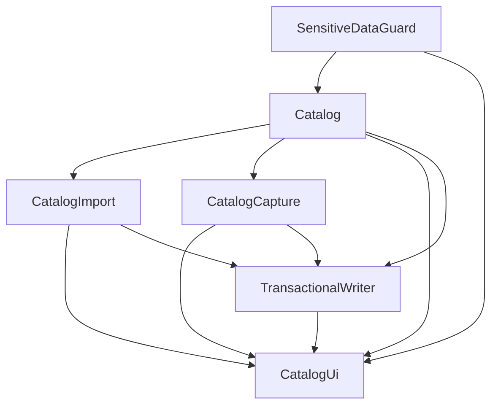

# Catalogue des composants — U4 Catalogue

Entrées : réponses Q1–Q4 = **A** ; `scope-document.md` ; maquettes raffinées ; `team-practices.md` ; catalogue U3 (`260916-caisse-hors-ligne-3`) pour les briques réutilisées. Requirements analysis sautée : couverture FR3.1–FR3.8.

Un composant est du **code à écrire**, pas de l’infra. La base SQLite, l’imprimante USB et un éventuel OCR sont des **dépendances externes**. Identifiants en anglais (glossaire). Ce document ne reprend que les briques **touchées ou ajoutées par U4** ; StockLedger, SaleCalculator, CashSession, etc. restent tels que tranchés en U3.

## Catalogue

```yaml
components:
  - name: Catalog
    summary: Articles, unités de vente, prix de référence et plancher, recherche, désactivation
    behaviour: >
      Fonctions pures dans packages/domain. Code interne unique par tenant ; plancher ≤ prix
      de référence ; au moins une unité de vente (base facteur 1). Jamais de suppression :
      désactivation seulement. Recherche insensible à la casse et aux accents sur désignation,
      synonymes, code interne et code-barres. Création minimale à quatre champs ; suggestion
      de multiple de prix refusables ; duplication sans quantité. Aucune quantité de stock
      créée ici. Les lectures de coûts passent par SensitiveDataGuard.
    responsibilities:
      - Valider et détenir la forme d'une fiche article et de ses unités
      - Fournir la recherche et la liste des articles à compléter
      - Générer un code interne court et préparer le contenu d'étiquette (sans imprimer)
    depends_on:
      - component: SensitiveDataGuard
        interaction: filtre prix d'achat / CUMP / marge selon le rôle
        style: sync
    dependents:
      - component: CatalogImport
        interaction: valide chaque ligne avant écriture
      - component: CatalogCapture
        interaction: crée les articles après vérification humaine
      - component: CatalogUi
        interaction: fiche, recherche, désactivation, étiquette
      - component: TransactionalWriter
        interaction: reçoit les commandes create/update/deactivate à persister
    entities:
      - name: Product
        identifier: id
        attributes: [id, tenantId, internalCode, barcode, name, altNames, categoryId, baseUnit, averagePurchaseCost, referencePrice, floorPrice, stockAlertThreshold, location, active]
      - name: SellingUnit
        identifier: id
        attributes: [id, productId, label, conversionFactor, price, floorPrice]
        references:
          - entity: Product
            owned_by: Catalog
            relationship: chaque unité de vente appartient à un article
      - name: Category
        identifier: id
        attributes: [id, tenantId, name, parentId]

  - name: CatalogImport
    summary: Import générique CSV/Excel avec mapping, prévisualisation et rapport
    behaviour: >
      Mapping de colonnes à l'écran (pas un format unique câblé). Prévisualisation : lignes
      OK, avertissement, erreur, doublon. Une ligne en erreur n'empêche pas les autres.
      Réimport : correspondance par code interne, pas de doublon d'article, aucun mouvement
      de stock. Fournit un modèle de fichier téléchargeable. Valide chaque ligne via Catalog
      puis remet un lot à TransactionalWriter.
    responsibilities:
      - Porter le mapping de colonnes et la prévisualisation d'import fichier
      - Produire le rapport d'erreurs téléchargeable
      - Garantir articles et prix seulement (jamais de quantité)
    depends_on:
      - component: Catalog
        interaction: valide et normalise chaque ligne d'article
        style: sync
    dependents:
      - component: CatalogUi
        interaction: assistant import (étapes 1 à 4)
      - component: TransactionalWriter
        interaction: écrit le lot d'articles validés et l'outbox
    entities:
      - name: ImportBatch
        identifier: id
        attributes: [id, tenantId, sourceFileName, columnMapping, previewRows, status, errorReportPath, createdBy, createdAt]

  - name: CatalogCapture
    summary: Photo du registre → extraction → vérification humaine → import
    behaviour: >
      Fichier image déjà sur le disque (pas de caméra). Extraction désignations et prix de
      vente seulement. Écran de vérification obligatoire. Aucun envoi d'image ni de prix
      d'achat à un tiers tant que CR-02 n'est pas levé ; à défaut de spécimen, voie sur
      l'appareil figée. Après validation, crée via Catalog puis TransactionalWriter.
      Aucune quantité de stock.
    responsibilities:
      - Piloter extraction et vérification avant import photo
      - Isoler l'adaptateur de reconnaissance (choix figé en fin U4)
    depends_on:
      - component: Catalog
        interaction: crée les articles validés
        style: sync
    dependents:
      - component: CatalogUi
        interaction: assistant photo (même prévisualisation que l'import)
      - component: TransactionalWriter
        interaction: écrit les articles validés et l'outbox
    entities:
      - name: CaptureBatch
        identifier: id
        attributes: [id, tenantId, sourceImages, extractedLines, status, reviewedBy, reviewedAt]
    external_dependencies:
      - name: TextRecognition
        kind: other
        purpose: OCR sur l'appareil (défaut CR-02) ou service tiers après spécimen ; jamais de prix d'achat transmis

  - name: CatalogUi
    summary: Onglet Catalogue dans apps/pc-proof — recherche, fiche, wizards, clavier-first
    behaviour: >
      Renderer Electron. Aucune règle métier. Affiche selon le rôle (vendeur = recherche
      seule). Wizard partagé import/photo. Focus clavier, suggestion de prix, saisie en
      série. Demande l'impression d'étiquette via l'adaptateur d'impression déjà livré.
      Ne rend jamais les nœuds de coûts pour le vendeur (après SensitiveDataGuard).
    responsibilities:
      - Rendre les écrans des maquettes raffinées
      - Orchestrer IPC vers domaine / écriture locale
    depends_on:
      - component: Catalog
        interaction: recherche, fiche, désactivation, contenu d'étiquette
        style: sync
      - component: CatalogImport
        interaction: assistant import fichier
        style: sync
      - component: CatalogCapture
        interaction: assistant photo
        style: sync
      - component: SensitiveDataGuard
        interaction: projection lisible sans coûts pour le vendeur
        style: sync
      - component: TransactionalWriter
        interaction: commit des mutations catalogue
        style: sync
    dependents: []
    entities: []
    external_dependencies:
      - name: ElectronRenderer
        kind: other
        purpose: coquille déjà livrée apps/pc-proof
      - name: UsbEscPosPrinter
        kind: other
        purpose: impression d'étiquette article (adaptateur ESC/POS existant)

  - name: SensitiveDataGuard
    summary: Masquage par rôle des coûts et marges (CT-09, DEC-01)
    behaviour: >
      Réutilisé tel quel depuis U3. Reçoit le rôle et retire prix d'achat, CUMP, marge,
      valorisation. Une seule implémentation pour caisse et API future. U4 n'ajoute pas
      de second filtre dans Catalog.
    responsibilities:
      - Filtrer toute lecture de donnée sensible selon le rôle
    depends_on: []
    dependents:
      - component: Catalog
        interaction: lectures de fiche / recherche enrichie
      - component: CatalogUi
        interaction: projection UI vendeur
    entities: []

  - name: TransactionalWriter
    summary: Écriture atomique articles + audit + outbox (réutilisé, étendu pour U4)
    behaviour: >
      Propriétaire unique de la transaction locale (ADR U3). Étendu pour persister
      Product / SellingUnit / lots d'import et de capture avec journal_audit et outbox
      dans la même transaction. Filtre tenant_id. Refuse toute écriture partielle.
    responsibilities:
      - Persister les commandes catalogue de façon atomique avec outbox
    depends_on:
      - component: Catalog
        interaction: reçoit create/update/deactivate validés
        style: sync
      - component: CatalogImport
        interaction: reçoit un ImportBatch validé
        style: sync
      - component: CatalogCapture
        interaction: reçoit un CaptureBatch validé
        style: sync
    dependents:
      - component: CatalogUi
        interaction: déclenche le commit depuis l'UI
    entities: []
    external_dependencies:
      - name: LocalEncryptedSqlite
        kind: database
        purpose: packages/db — tables products, selling units, outbox, audit_log
```

## Diagramme des composants



Lecture : flèche du fournisseur vers l’appelant.

## Résumé des composants

| Composant | Rôle | Dépend de | Appelé par | Entités |
|---|---|---|---|---|
| Catalog | Fiche, recherche, désactivation, code interne / étiquette (contenu) | SensitiveDataGuard | CatalogImport, CatalogCapture, CatalogUi, TransactionalWriter | Product, SellingUnit, Category |
| CatalogImport | Import fichier générique | Catalog | CatalogUi, TransactionalWriter | ImportBatch |
| CatalogCapture | Photo + OCR + vérification | Catalog | CatalogUi, TransactionalWriter | CaptureBatch |
| CatalogUi | UI caisse (`pc-proof`) | Catalog, CatalogImport, CatalogCapture, SensitiveDataGuard, TransactionalWriter | — | — |
| SensitiveDataGuard | Masquage CT-09 | — | Catalog, CatalogUi | — |
| TransactionalWriter | Persist + outbox | Catalog, CatalogImport, CatalogCapture | CatalogUi | — |

## Propriété des entités

| Entité | Composant | Identifiant | Attributs (noms) | Références |
|---|---|---|---|---|
| Product | Catalog | id | id, tenantId, internalCode, barcode, name, altNames, categoryId, baseUnit, averagePurchaseCost, referencePrice, floorPrice, stockAlertThreshold, location, active | — |
| SellingUnit | Catalog | id | id, productId, label, conversionFactor, price, floorPrice | Product (Catalog) |
| Category | Catalog | id | id, tenantId, name, parentId | — |
| ImportBatch | CatalogImport | id | id, tenantId, sourceFileName, columnMapping, previewRows, status, errorReportPath, createdBy, createdAt | — |
| CaptureBatch | CatalogCapture | id | id, tenantId, sourceImages, extractedLines, status, reviewedBy, reviewedAt | — |

## Dépendances externes

| Composant | Dépendance | Kind | Purpose |
|---|---|---|---|
| CatalogCapture | TextRecognition | other | OCR ; défaut sur appareil (CR-02) |
| CatalogUi | ElectronRenderer | other | Shell `apps/pc-proof` |
| CatalogUi | UsbEscPosPrinter | other | Étiquette article |
| TransactionalWriter | LocalEncryptedSqlite | database | Persistance + outbox |

## Rationale

| Composant | Pourquoi une brique séparée |
|---|---|
| Catalog | Règles stables, tests d’abord dans `domain` ; cœur métier indépendant de l’OCR et du format fichier |
| CatalogImport | Mapping générique et cycle de vie de lot distincts de la fiche unitaire ; change quand le format fournisseur change |
| CatalogCapture | OCR réversible / CR-02 ; ne doit pas contaminer Catalog (ADR U3-004 confirmé) |
| CatalogUi | Maquettes et clavier-first ; zéro règle métier (pratiques Q5) |
| SensitiveDataGuard | Invariant sécurité unique (ADR U3-002) |
| TransactionalWriter | Atomicité donnée + outbox (ADR U3-003) étendue au catalogue |

**Alternatives rejetées (Q1–Q4).** Un seul Catalog pour import+photo : lierait le cœur métier à l’OCR. UI dans Catalog : mélangerait React/Electron et fonctions pures. Outbox par chaque composant : risque d’écriture partielle. Filtrage CSS seul : contredit CT-09 / DEC-01.
