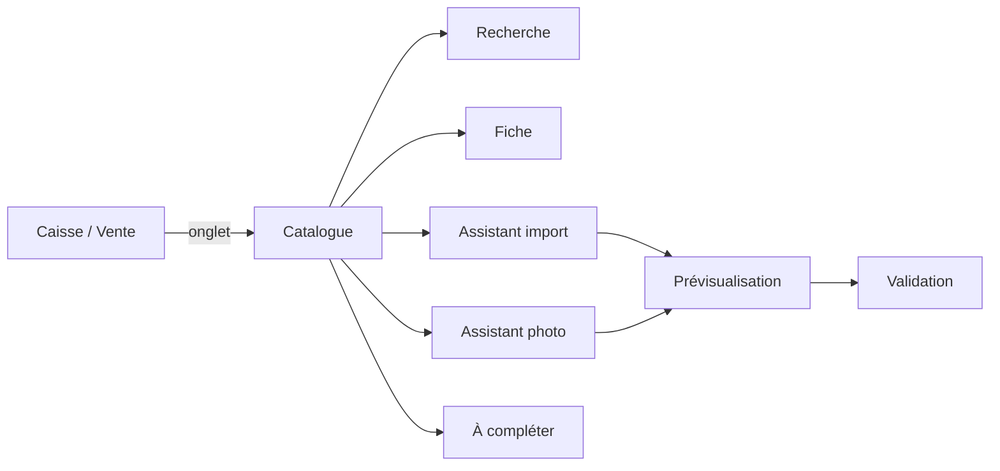

# Maquettes raffinées — Catalogue U4

Entrées : réponses Q1–Q4 = **A** ; `scope-document.md` ; EF-U2-* / FR3.* ; pratiques affirmées. Pas de wireframes ni d’histoires (étapes sautées) — écrans dérivés du périmètre.

Cible : `apps/pc-proof` (Electron, desktop). Interface en français. PC d’abord ; tablette hors intention.

## Navigation globale (Q1-A)

```
┌──────────────────────────────────────────────────────────────┐
│ [Logo / Tenu]  Caisse │ Catalogue │ …    Opérateur · Rôle   │
└──────────────────────────────────────────────────────────────┘
```

| Rôle | Onglet Catalogue | Contenu |
|---|---|---|
| Vendeur | Oui | Recherche + résultats seulement ; aucune création, import, photo, prix d’achat / CUMP / marge |
| Gérant / Propriétaire | Oui | Recherche + fiche, saisie en série, import, photo, articles à compléter, désactivation |

L’écran de vente (u3) conserve sa propre recherche d’ajout au ticket (EF-U3-10 / EF-U3-17). L’onglet Catalogue ne remplace pas ce flux.

## Écran C1 — Recherche + fiche (Q2-A)

Écran unique, deux colonnes (desktop ≥ 1024 px). Priorité Bolt C1.

```
┌─ Catalogue ──────────────────────────────────────────────────┐
│ [Recherche___________]  (focus initial)                       │
│ ┌─ Résultats ──────────────┐  ┌─ Fiche / Création ─────────┐ │
│ │ ● Clé à molette 12        │  │ Désignation *              │ │
│ │   code INT-0042  2 500 F  │  │ Unité de base *           │ │
│ │ ○ Fer 8                   │  │ Prix de vente *            │ │
│ │ …                         │  │ Prix plancher *            │ │
│ │ (vide : « Aucun article »)│  │ [champs facultatifs…]      │ │
│ └───────────────────────────┘  │ [Enregistrer] [Dupliquer]  │ │
│                                 │ [Désactiver]               │ │
│ Actions propriétaire :          └────────────────────────────┘ │
│ [Importer un fichier] [Photo du registre] [À compléter]       │
└──────────────────────────────────────────────────────────────┘
```

### États

| État | Comportement |
|---|---|
| Chargement recherche | Liste avec indicateur ; champ recherche reste éditable |
| Vide | Message « Aucun article. Créez-en un ou importez un fichier. » (propriétaire) / « Aucun résultat. » (vendeur) |
| Erreur métier | Message sous le champ concerné (ex. plancher > prix) ; pas de code technique |
| Succès création | Toast bref ; formulaire se rouvre pour saisie en série (EF-U2-07) si mode série |
| Article sélectionné | Fiche remplie ; vendeur : lecture seule sans coûts |
| Article inactif | Badge « Désactivé » ; hors résultats de caisse (EF-U2-05) |

### Masquage vendeur (CT-09)

Sur la fiche et dans les listes : jamais prix d’achat, CUMP, marge, valorisation. Les champs absents ne sont pas affichés grisés — ils n’existent pas dans le DOM pour ce rôle.

## Écran C2 — Saisie clavier rapide (EF-U2-06 à EF-U2-12)

Même coquille C1 ; mode « création en série » activé après le premier enregistrement réussi.

- Curseur → désignation après chaque validation.
- Catégorie, unité de base, emplacement repris de l’article précédent.
- Suggestion multiple de 50 (RG-01) affichée à côté du prix, **refusable**.
- Synonymes : champ texte, virgules (EF-U2-12).
- Raccourcis : `Entrée` = enregistrer ; `Échap` = annuler la fiche en cours (sans quitter l’onglet).

## Écran C3 / C4 — Assistants import & photo (Q3-A)

Même parcours en étapes ; seule l’étape 1 change.

```
Étapes :  1. Source  →  2. Mapping / Extraction  →  3. Prévisualisation  →  4. Validation
```

| Étape | Import fichier | Photo registre |
|---|---|---|
| 1 | Choisir CSV/Excel déjà sur le disque | Choisir fichier image déjà sur le disque (pas de caméra) |
| 2 | Associer colonnes du fichier → champs article | Afficher texte / lignes extraites (OCR) ; édition manuelle |
| 3 | **Prévisualisation partagée** : lignes OK / avertissement / erreur | Idem ; vendeur : pas de colonne prix d’achat même si présente dans le fichier/OCR |
| 4 | Valider → rapport d’erreurs téléchargeable ; lignes en erreur non bloquantes | Idem |

Pas d’envoi d’image ni de prix d’achat à un tiers tant que CR-02 n’est pas levé (spécimen).

## Écran « Articles à compléter » (EF-U2-09)

Liste triée par nombre de ventes décroissant ; ouverture de la fiche C1 au clic. Accessible depuis Catalogue (propriétaire / gérant).

## Flux résumé


